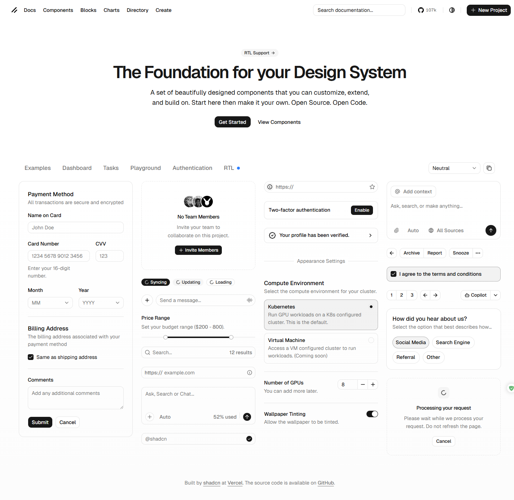
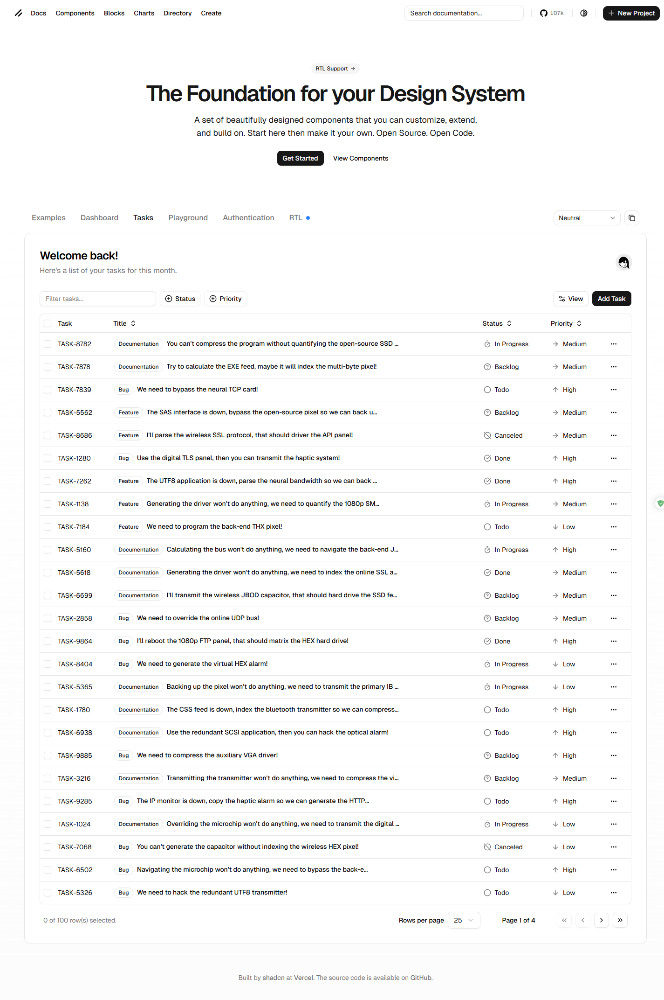
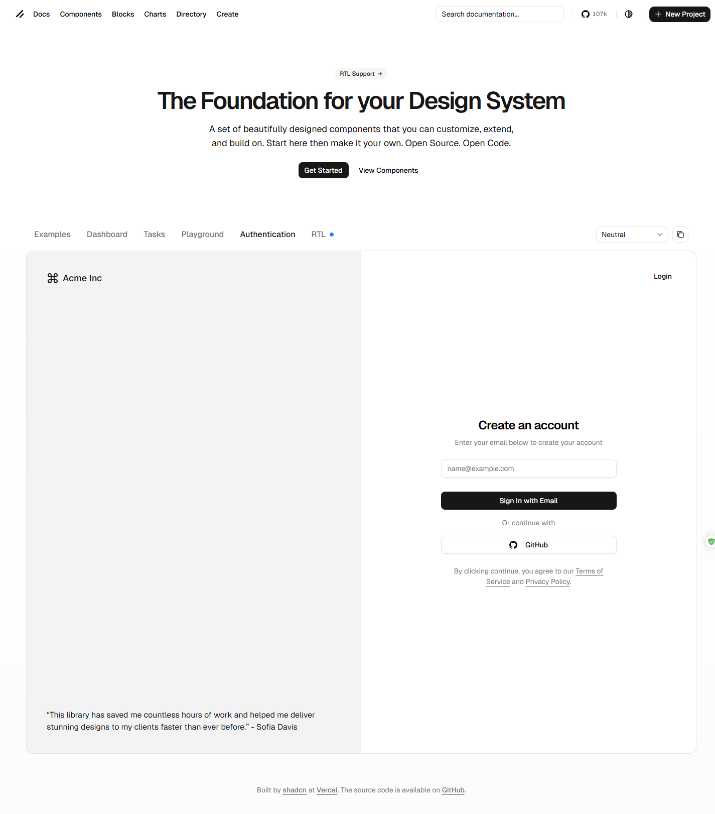

# shadcn/ui 디자인 레퍼런스 분석

- 수집 일시: 2026-02-17
- 원본: https://ui.shadcn.com/
- 캡처 조건: Desktop `1440x1100`, full-page PNG, 기본 `Neutral` 테마(라이트)

## 캡처 파일

| 파일 | 원본 URL | 메모 |
| --- | --- | --- |
| `design_ref/shadcn-home.png` | `https://ui.shadcn.com/` | 메인/Examples 탭과 컴포넌트 프리뷰 |
| `design_ref/shadcn-dashboard.png` | `https://ui.shadcn.com/examples/dashboard` | SaaS 대시보드 패턴(사이드바, KPI, 차트, 데이터테이블) |
| `design_ref/shadcn-tasks.png` | `https://ui.shadcn.com/examples/tasks` | 태스크 관리 테이블 패턴(필터/배지/행 액션) |
| `design_ref/shadcn-playground.png` | `https://ui.shadcn.com/examples/playground` | 옵션 패널 + 실행 영역의 툴형 UI |
| `design_ref/shadcn-authentication.png` | `https://ui.shadcn.com/examples/authentication` | 인증 화면(브랜드 카피 + 폼 중심) |

## 빠른 미리보기

## 공통 디자인 DNA

1. 톤앤매너
- 채도 낮은 뉴트럴 팔레트, 대비는 명확(텍스트는 거의 블랙 계열).
- 깊은 그림자 대신 `border`와 `spacing`으로 계층 분리.
- 라운드는 과하지 않고 일관된 작은 반경(8~10px 중심).

2. 토큰(실제 CSS 변수 추출값)

| Token | 값 |
| --- | --- |
| `--background` | `lab(100% 0 0)` |
| `--foreground` | `lab(2.75381% 0 0)` |
| `--primary` | `lab(7.78201% -.0000149012 0)` |
| `--primary-foreground` | `lab(98.26% 0 0)` |
| `--muted` | `lab(96.52% -.0000298023 .0000119209)` |
| `--muted-foreground` | `lab(48.496% 0 0)` |
| `--border` | `lab(90.952% 0 -.0000119209)` |
| `--radius` | `.625rem` (약 10px) |

3. 타이포/컴포넌트 밀도
- 기본 폰트: `Geist`
- Body: `16px / 24px`
- 인증 예시 기준:
  - Input: `14px`, 높이 `36px`, 좌우 패딩 `12px`, radius `8px`, 1px border
  - Primary Button: `14px`, `500`, 높이 `36px`, 좌우 패딩 `16px`, radius `8px`
- 대시보드 테이블 기준:
  - 헤더: `14px`, `500`, 높이 `40px`
  - 셀: `14px`, `400`, 높이 `53px`

4. 레이아웃 원칙
- 상단 글로벌 내비 + 페이지별 작업영역을 분리.
- 정보 밀도는 높지만, 충분한 여백과 구획선으로 가독성 유지.
- 인터랙션은 일관된 패턴(드롭다운, 탭, 배지, 아이콘 버튼)을 반복해 학습 비용 최소화.

## 페이지별 참고 포인트

### 1) Dashboard (`shadcn-dashboard.png`)
- 구조: 좌측 탐색 + 상단 액션 + KPI 카드 + 시계열 차트 + 대형 데이터테이블.
- 포인트: “요약(카드) → 추세(차트) → 상세(테이블)” 순서로 정보 계층이 명확함.

### 2) Tasks (`shadcn-tasks.png`)
- 구조: 제목/설명 + 필터바 + 대용량 테이블 + 페이지네이션.
- 포인트: 상태/우선순위를 텍스트+배지로 빠르게 스캔할 수 있게 설계.

### 3) Playground (`shadcn-playground.png`)
- 구조: 좌측 설정 패널(모드/모델/슬라이더) + 우측 입력/실행 영역.
- 포인트: 컨트롤 밀도가 높아도 간격/정렬 규칙이 일정해서 복잡도가 낮게 보임.

### 4) Authentication (`shadcn-authentication.png`)
- 구조: 브랜드 메시지 영역 + 단일 목적 폼.
- 포인트: CTA를 한 경로(이메일)로 집중시키고, 보조 로그인은 분리선 아래로 배치.

## 우리 앱 반영 시 체크리스트

1. 토큰 우선: 컬러/라운드/보더를 컴포넌트 내부 하드코딩 대신 공통 토큰으로 관리.
2. 계층 우선: 그림자보다 `border + spacing + 타이포 굵기`로 레이어를 만든다.
3. 밀도 통일: 입력/버튼/테이블의 높이 스케일(`36`, `40`, `53`)을 화면 전반에 일관 적용.
4. 흐름 설계: 화면마다 `요약 → 조작 → 상세` 순서를 먼저 고정한 뒤 컴포넌트를 배치.
5. 변형 최소화: 커스텀을 하더라도 기본 상호작용 패턴(탭, 드롭다운, 배지, 테이블)을 유지.
